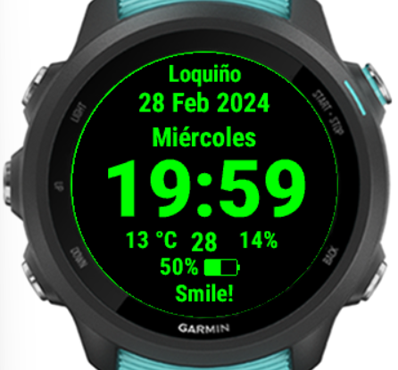

# GarminWatchFace version 0.9.1

This my first Garmin watch face.
Built with SDK Connect IQ 6.4.2
Primary device: Forerunner 245 Music

## Features

- Screensaving:
  - Chameleon color: auto-changing color every hour
  - Inversion color: auto-inverting the colors for one minute every 30 minutes
- Spanish months, days of the week
- Feels-like temperature (if feels-Like is not available, temperature is displayed)
- Precipitation chance
- Battery
- Heart rate
- Second

## Features in development

- Customizing
- Supporting English

## Known bugs (on Forerunner 245 Music model)

- Crashing after a few hours running on device due to unavailable weather info (fixed)
- Battery does not display properly at 100% (fixed)
- Failing to automatically exit sleep mode:
  - after receiving move-bar-cleared notification
  - in some other unknown cases
- Failing to display temperature when current feels-Like temperature is not available. (fixed)

## Release notes

### Version 0.9.2

- Display temperature when feels-Like temperature is not available
- Adjusted battery position

### Version 0.9.1

- Fixed crashes when weather info is not available
- Fixed text width of:
  - Battery,
  - Heart rate,
  - Temperature
  - Precipitation chance,
  - Hour
