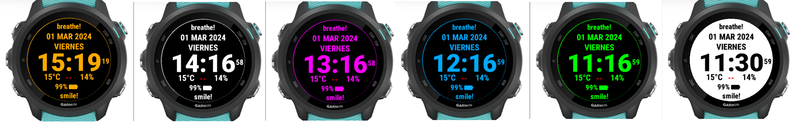

# GarminWatchFace version 0.9.1

This my first Garmin watch face.  
Built with SDK Connect IQ 6.4.2  
Primary device: Forerunner 245 Music

## Features

- Screensaving:
  - Chameleon color: auto-changing color every hour
  - Inversion color: auto-inverting the color every 30 minutes
- Spanish months, days of the week
- Feelslike temperature
- Precipitation chance
- Battery
- Heart rate

## Features in development

- Customizing

## Known bugs

- crashing after a few hours running on device.
- battery does not display properly at 100% (fixed)

## Release notes

### Version 0.9.1

- App crashes when temperature is not available (fix being tested)
- Fixed text width of:
  - battery,
  - heart rate,
  - temperature
  - precipitation chance,
  - hour
